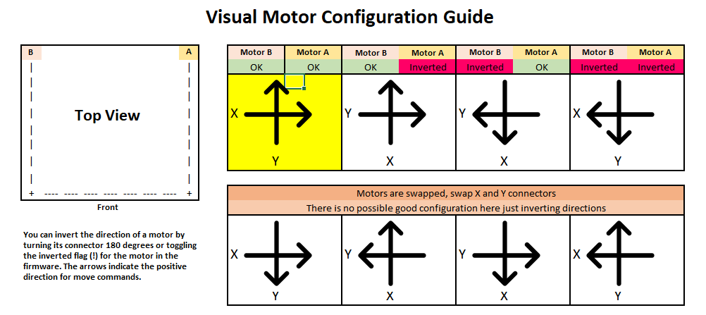

# Voron Mechanics

[TOC]

## Basics
Generally, follow the manual when building the Voron, when in doubt either check the [Voron Manual Breakdown](https://www.voron.dev/home/voron-2-2-supplement/2-2-manual-breakdown) or ask for advice in the [Voron Discord](https://discord.gg/wfwFKuf)

A few useful tips:
* General advice
    * Avoid excessive force :smile: 
    * Take your time, measure twice
    * This is not rocket science, we do not need 0.001 mm precision :smile: 
* Frame
    * A granite countertop or other similarly flat surfaces helps with rail alignment to ensure a square frame
    * Measure diagonals to check squareness
    * Using blind joints extrusions may rotate. This will be prevented by the panel corners and skirts later in the build
    * Frame screws do not need loctite
* Idler / drive unit assembly
    * The assumed standard washer thickness is 1mm. Washer thickness varies, so washer counts in the manual are meant as  guidance. Your washer count may vary. Also, it may be useful to have 0.5mm washers at hand to align pulleys and bearings optimally in your build
    * Make sure your pulleys are GT2/2GT!
    * Make sure your pulleys do not wobble. Just rotate them on a shaft and look for eccentric movement of the teeth. The flanges are not critical.
    * Use gates GT2/2GT belts for the open loop belts!
    * A bit of shaft lean is fine
    * A/B closed belt pulleys should be mounted with the teeth close to the module to minimize shaft lean
* Belt tension
    * Z belts can be tensioned by resonance frequency around 140 Hz with the gantry in the middle and using the fixed end (best way to measure is a proper microphone and a PC using for example audacity)
    * Make sure that all z belts are of equal length and both gantry belts are of equal length!
    * Hemostats help a lot when tensioning the gantry belts if you don't have a helping hand
    * Do not cut belts flush, leave a bit for adjustments or reassembly: 

* Gantry assembly
    * The gantry can be assembled and belted before you fix it to the frame.
    * Routing the belt in the a/b drives looks tricky, but there are several ways to ease this:
        * Fix something stiff like a cable tie or some wire to the end of the belt to help with routing
        * Use dental picks to guide the belt
    * Screws should not be too tight to allow movement when doing quad gantry adjustments
    * Gantry should be squared with equal belt tension. Tension gantry belts with the toolhead at the front center position
    * Measure both diagonals to ensure squareness

## Sourcing
Follow the [Official Sourcing Sheet](https://docs.google.com/spreadsheets/d/1QS80JOHcgBIABJrAD7sIsVr5nARIzHsFrJnI4P4npgs/) to buy Voron parts.

! The sourcing sheet is copy protected on purpose to prevent outdated copies. This way the development team can guarantee an up-to-date sheet

## Printing Voron parts
Follow the [Printing Guideline](https://www.voron.dev/home/voron-2-1/faq#whataretherecommendedprintsettin...) when printing Voron parts or apply for Print It Forward (PIF) via [Voron Discord](https://discord.gg/wfwFKuf) to get a quality controlled community printed set.

## [Useful Videos](https://www.voron.dev/help-videos)

## Useful modifications
### Vibration Dampening
Voron 2.1 uses dampener on every stepper driver to reduce the amount of vibration that is transferred to the rails. However, some vibration will be emitted through side panels. To reduce vibrations in the panels the community has mostly come up with:
* Use standard foam tape applied to the panels (1mm thick)
* Apply foam tape to the panel anchors

! Note that the foam tape will add thickness such that panel anchors may need modification

### Coroplast panel holders / clips for the bed panel
Take a look at the [Github mods folder](https://github.com/VoronDesign/Voron-2/tree/master/Mods). Several users designed holding clips for the coroplast panel to achive a better look

### Insulation
Some users applied insulation below the heater to avoid heat transfer to the electronics and a achieve a faster heatup and more uniform heating of the bed

###### tags: 'Voron', 'Mechanics'

