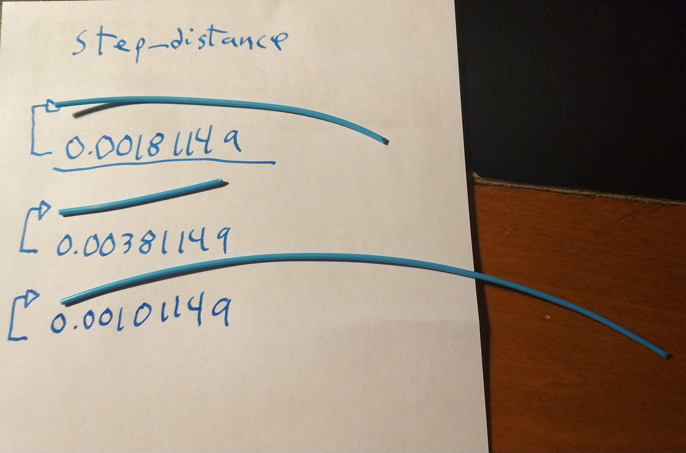

 There will be parts of calibration where you will be told to consult external ressources of Klipper for Pressure Advance tuning by example.

 * Start to tune your extruder steps without the bowden in and the filament must come out. Cut it, then extrude 100 mm via terminal with `G1 E100 F100` then cut again, you'll have the ~100 mm of filament ready to be measured. You must make sure this cut is flush against the face of coupling or you will get few unwanted millimeters. If it's difficult to measure against the face of coupling you could use a short (~5cm max) bowden for measurement. If this bowden is too long you'll get inaccurate measures because the filament may wiggle inside the bowden.

 Why this slow extruding, it has to be precise for the stepper.
 Guide for reference : [Guide](https://mattshub.com/2017/04/19/extruder-calibration/)

 The formula to find out new step. NOTE this formula only works for steps per mm. Modified formula is written after this section. :

   $$
   New\ steps = {Current\ steps * (100/measured\ length\ of\ filament)}
   $$

   In Klipper you have to set the step_distance in millimeter per step so you have to use this formula for your new steps to get the step_distance :
 	$$
     step\_distance = (1 / new\ steps)
     $$

   If you like to work with step_distance values then this formula follows as it :
 	$$
     New\ step\_distance = {Current\ step\_distance * 1 / (100/measured\ length\ of\ filament)}
     $$

   Why this multiplicative inverse ? This is because converting steps per mm to step_distance also inverts the relation steps/length(mm).

  

 * The guide to tune the PA is at [Klipper PA document](https://www.klipper3d.org/Pressure_Advance.html "Offical Klipper PA document")